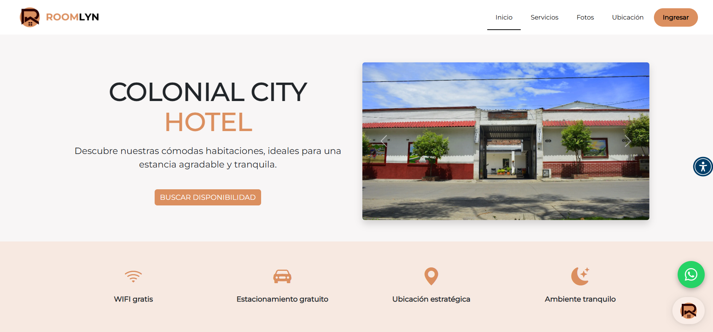
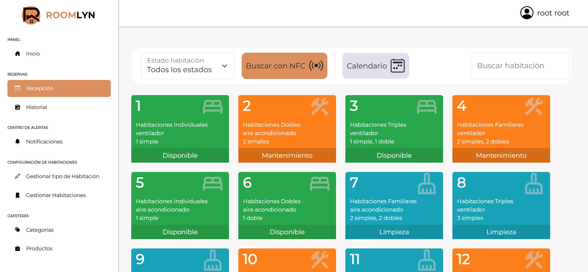
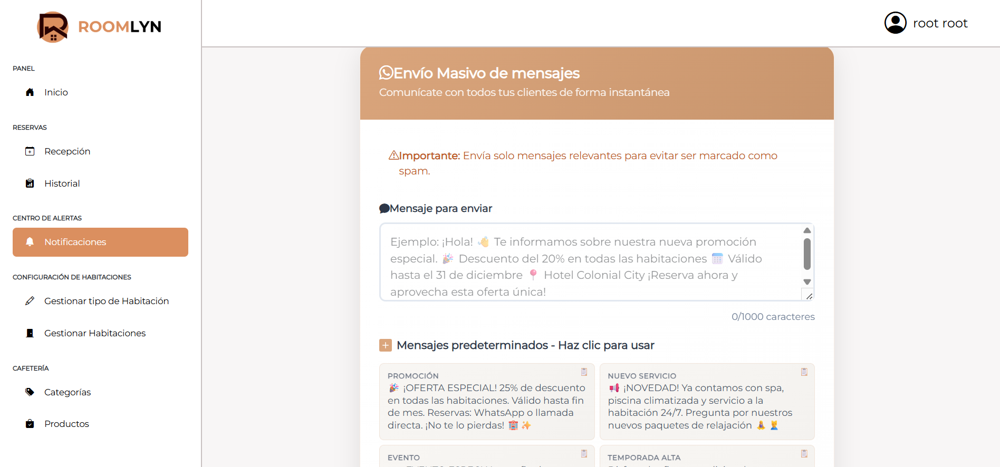

# 🌐 Roomlyn – Plataforma de Gestión de Reservas Hoteleras

**Roomlyn** es una aplicación web diseñada para optimizar la gestión de hoteles, hostales y moteles.  
Este repositorio funciona como **showcase** (muestra), con fines académicos y de portafolio.  
El código fuente del proyecto es **privado**, pero aquí encontrarás toda la información relevante del sistema.

---

## 🚀 Características principales
- 📅 Gestión de **reservas online** y desde recepción.  
- 🏨 Administración de habitaciones y su estado (disponible, ocupada, mantenimiento, limpieza).  
- 👤 Módulo de clientes y usuarios (empleados).  
- 📦 Control de inventario de productos del hotel.  
- 📊 Dashboard con estadísticas y gráficas interactivas (habitaciones más usadas, ingresos, etc.).  
- 🔑 Integración con **llaveros NFC/RFID** para accesos y consumos.  
- 📩 Notificaciones automáticas por **correo y WhatsApp**.  
- 🧾 Generación de facturas equivalentes según normativa.  

---

## 🛠️ Tecnologías utilizadas
- **Laravel 12** – Backend en PHP  
- **Livewire 3** – Interactividad en tiempo real  
- **Bootstrap 5** – Diseño responsive  
- **MySQL** – Base de datos relacional  
- **Chart.js** – Gráficas dinámicas  
- **Git & GitHub** – Control de versiones  

---

## 📸 Vista previa

*(Aquí colocas capturas reales o mockups del sistema en la carpeta `/images`)*  

Ejemplo:  
  
  
  
  

---

## ⚙️ Estado del proyecto
Roomlyn se encuentra en desarrollo activo y ha sido probado en un entorno real con un hotel mediano (**Hotel Colonial City**).  
Actualmente está en proceso de mejoras y optimización para futuras implementaciones.

---

## 👨‍💻 Autor
Desarrollado por **Juan David Hernández**  
📍 Espinal, Tolima – Colombia  
💼 Estudiante de Ingeniería de Sistemas | Programador Junior  

---

## ⚠️ Nota legal
Este repositorio es únicamente para fines **académicos y de portafolio**.  
El código fuente completo es **privado** y no está autorizado su uso comercial sin permiso del autor.  

---
